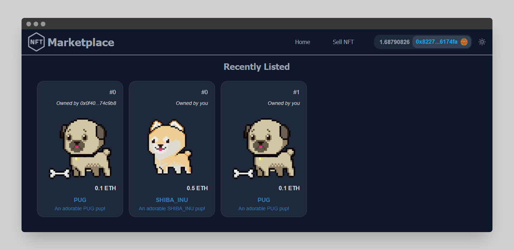
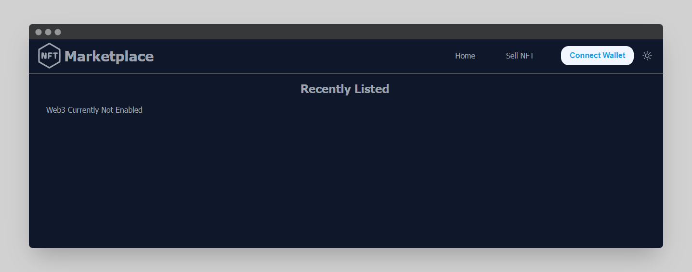
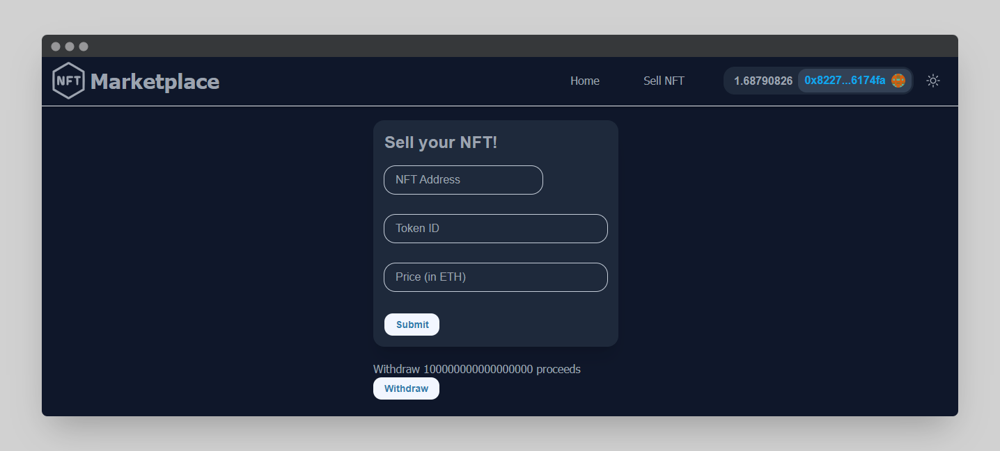

<h1 align="center">
    NextJS NFT Marketplace with TheGraph
</h1>

<h2 align="center">
    <a href="https://nft-marketplace-nextjs2.vercel.app/">
        <strong><p>Website</p></strong>
    </a>
</h2>

<br/>

<p align="center">

</a>
</p>

<br/>

This is a repo showing how to make an NFT Marketplace from scratch!

<hr/>
 
## 🗎&nbsp; Requirements
- [git](https://git-scm.com/book/en/v2/Getting-Started-Installing-Git)
    You'll know you did it right if you can run `git --version` and you see a response like `git version x.x.x`
    
- [Nodejs](https://nodejs.org/en/)

    You'll know you've installed nodejs right if you can run: `node --version` and get an ouput like: `vx.x.x`

-   [Yarn](https://yarnpkg.com/getting-started/install) instead of `npm`
    You'll know you've installed yarn right if you can run: `yarn --version` and get an output like: `x.x.x`
    You might need to [install it with `npm`](https://classic.yarnpkg.com/lang/en/docs/install/) or `corepack`

## 🛠️&nbsp; How to run

### Git clone the hardhat project repo

-   Clone the repo:
    ```
    git clone https://github.com/Meno96/nft-marketplace-hardhat.git
    ```
-   Enter the directory:
    ```
    cd nft-marketplace-hardhat
    ```
-   Install packages:
    ```
    yarn
    ```

### Deploy to goerli

After installing dependencies, deploy your contracts to goerli:

```
yarn hardhat deploy --network goerli
```

### Deploy your subgraph

```
cd ..
```

Follow the instructions of the [README](https://github.com/Meno96/nft-marketplace-thegraph/blob/master/README.md) of that repo.

Then, make a `.env` file and place your temporary query URL into it as `NEXT_PUBLIC_SUBGRAPH_URL`.

### 4. Start your UI

Make sure that:

-   In your `networkMapping.json` you have an entry for `NftMarketplace` on the goerli network.
-   You have a `NEXT_PUBLIC_SUBGRAPH_URL` in your `.env` file.

-   Clone this repo:
    ```
    cd ..
    ```
    ```
    git clone https://github.com/Meno96/nft-marketplace-nextjs.git
    ```
-   Enter the directory:
    ```
    cd nft-marketplace-nextjs
    ```
-   Install packages:
    ```
    yarn
    ```
-   Run UI:
    ```
    yarn dev
    ```

## 🚀&nbsp; How it's suppose to work?

-   Open [http://localhost:3000](http://localhost:3000) in your browser

    We will be redirected to this web page

<p align="center">

</a>
</p>
      
- Hit the `Connect` button, and you should see Metamask pop up.
  
    Now we will see that our wallet has been connected and we will be able to see the NFTs listed (connect to the Goerli network)
    
    <p align="center">
    
    </a>
    </p>

    If we click on an NFT we own, we could update the listing price, instead if we click on an NFT we don't own, we could buy it

-   If we click on Sell NFT we will be redirected to this page:

      <p align="center">
      
      </a>
      </p>

    where we could sell our NFTs and we could withdraw the proceeds in case we sell one of our NFTs.

## 🏴‍☠️&nbsp; Other Parts

You can find the backend part in [this repository](https://github.com/Meno96/nft-marketplace-hardhat.git)

and TheGraph part in [this repository](https://github.com/Meno96/nft-marketplace-thegraph.git)

## 📫&nbsp; Have a question? Want to chat?

[LinkedIn](https://www.linkedin.com/in/daniele-menin/)

[Instagram](https://www.instagram.com/danielemeno96/)
